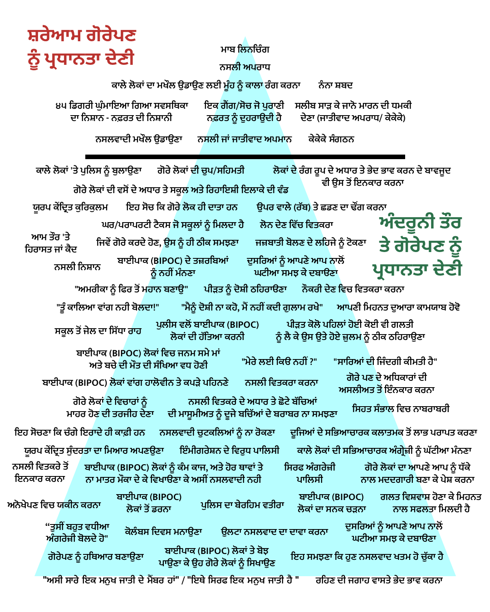
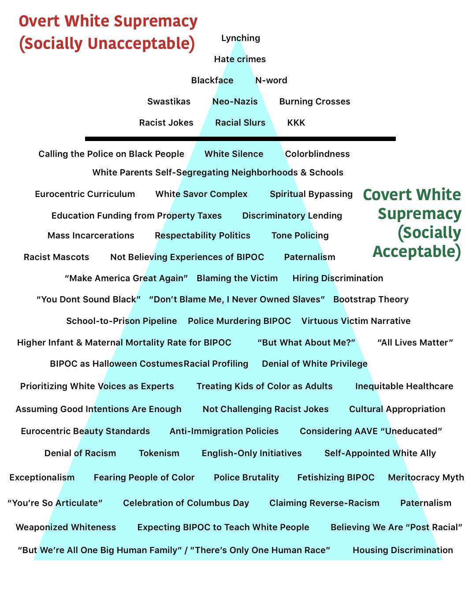

# Anti-Blackness & White Supremacy Terms - Punjabi Translations
These are the Punjabi translations for the popular White Supremacy 🔺 graphic featuring a set 📑 of 67 terms that describe overt &amp; covert forms of racism. The Punjabi translations are accompanied by their English transliterations, and some handy links to 📰 articles and other 🎥 🎤 🎧 🎨 media that explain or are references for each concept.

### [Punjabi Graphic](img/Punjabi.png) | [Punjabi Transliterated Graphic](img/Punjabi%20Transliteration.png) | [Original Graphic]()

  

## Who is this for?

Lorem ipsum dolor sit amet, consectetur adipiscing elit, sed do eiusmod tempor incididunt ut labore et dolore magna aliqua. Ut enim ad minim veniam, quis nostrud exercitation ullamco laboris nisi ut aliquip ex ea commodo consequat. Duis aute irure dolor in reprehenderit in voluptate velit esse cillum dolore eu fugiat nulla pariatur. Excepteur sint occaecat cupidatat non proident, sunt in culpa qui officia deserunt mollit anim id est laborum.

## Terms, Translations, Transliterations, Expanded Explanations, Reference Links

Below, each term is translated individually in the Gurmukhi script for Punjabi, then transliterated into English for easier reading. Some terms also have an 📌 expanded definition for contextualization or clarifications of the shorter translation. Where appropriate, links 🔗 have been added that offer general explanations or examples where these issues directly effect BIPOC, or specifically South Asians in North America 🌎. 

## Overt White Supremacy - ਸ਼ਰੇਆਮ ਗੋਰੇਪਣ ਨੂੰ ਪ੍ਰਧਾਨਤਾ ਦੇਣੀ  - shareyaam gorepaN noo(n) pardhaantaa deNee    

### 1. Lynching	
	ਮਾਬ ਲਿਨਚਿੰਗ	
	maab linching	
	
	📌 Expanded Explanation:
	ਕਾਨੂੰਨੀ ਅਧਿਕਾਰ ਬਿਨਾ ਮਾਰਨਾ	
	kanoonee adhikaar benaa maarnaa
	
🔗 References: 

[“The oppression doesn’t end, it adapts”](https://www.vox.com/21295670/robert-fuller-malcolm-harsch-hanging-history-lynching) 

[Terror Lynching in America](https://www.youtube.com/watch?v=aS61QFzk2tI) 

### 2. Hate crimes	
	ਨਸਲੀ ਅਪਰਾਧ	
	naslee apraadh	

	📌 Expanded Explanation:
	ਭੇਦ ਭਾਵ ਨਾਲ ਜ਼ੁਲਮ ਕਰਨਾ	
	bhed bhaav naal zulm karnaa
	
🔗 References: 

[Hate Crimes Explained](https://www.splcenter.org/20180415/hate-crimes-explained)

[Black Americans still are victims of hate crimes more than any other group](https://publicintegrity.org/politics/black-americans-still-are-victims-of-hate-crimes-more-than-any-other-group/)

[Gunman Kills 6 at a Sikh Temple Near Milwaukee](https://www.nytimes.com/2012/08/06/us/shooting-reported-at-temple-in-wisconsin.html)

[Chronicling Anti-Sikh Violence, and Now a Victim](https://www.nytimes.com/2013/09/24/nyregion/chronicling-anti-sikh-violence-and-now-a-victim.html)

### 3. Blackface 	
	ਕਾਲੇ ਲੋਕਾਂ ਦਾ ਮਖੌਲ ਉਡਾਉਣ ਲਈ ਮੂੰਹ ਨੂੰ ਕਾਲਾ ਰੰਗ ਕਰਨਾ	
	kale lokaa(n) da maKhaul udaa-ouN layee mooh noo(n) kaalaa rang karnaa		
	
🔗 References:

[Why is Blackface Offensive](https://www.vox.com/2014/10/29/7089591/why-is-blackface-offensive-halloween-costume)

[Blackface, Staple of Arab Comedy](https://www.nytimes.com/2019/08/18/world/middleeast/blackface-arab-tv-racist.html)

[Brownface at Bon Appetit](https://www.insider.com/bon-appetit-editor-adam-rapoport-resigned-dressed-puerto-rican-photo-2020-6)

### 4. The N-word	
	ਨੰਨਾ ਸ਼ਬਦ 	
	nanaa shabad	

	📌 Expanded Explanation:
	ਗੈਰ ਕਾਲੇ ਲੋਕਾਂ ਵਲੋਂ ਨੰਨੇ ਸ਼ਬਦ ਨੂੰ ਗਾਲ ਦੇ ਤੌਰ ਤੇ ਵਰਤਨਾ	
	ghair kaale lokaa(n) valoo(n) nane shabad noo(n) gaal de taor te vartanaa
	
🔗 References:

[When Latinx People Use the N-Word](https://www.nytimes.com/2019/10/17/opinion/gina-rodriguez-n-word-latinx.html)

[BBC apologizes for use of N-word in news report](https://www.cnn.com/2020/08/10/media/bbc-apology-offensive-language-scli-intl-gbr/index.html)

### 5. Swastikas	
	੪੫ ਡਿਗਰੀ ਘੁੰਮਾਇਆ ਗਿਆ ਸਵਸਥਿਕਾ ਦਾ ਨਿਸ਼ਾਨ - ਨਫ਼ਰਤ ਦੀ ਨਿਸ਼ਾਨੀ	
	45 digree ghumaa-iya giyaa swasthikaa daa nishaan - nafrat di nishaani	
	
🔗 References:

### 6. Neo-Nazis	
	ਇਕ ਗੈਂਗ/ਸੋਚ ਜੋ ਪੁਰਾਣੀ ਨ਼ਫਰਤ ਨੂੰ ਦੁਹਰਾਉਦੀ ਹੈ	
	ik gang/soch jo puraaNee nafrat noo(n) duraa-ondee hai	

	📌 Expanded Explanation:
	ਹਿਟਲਰ ਦੀ ਨਾਜੀ ਪਾਰਟੀ ਦੀ ਨ਼ਫਰਤ ਵਾਲੀ ਸੋਚ	
	hiTler dee naazee parTee dee nafrat vaalee soch
	
🔗 References:

[Self-described Nazis and white supremacists are running as Republicans across the country](https://www.vox.com/2018/7/9/17525860/nazis-russell-walker-arthur-jones-republicans-illinois-north-carolina-virginia)

### 7. Burning Crosses	
	ਸਲੀਬ ਸਾੜ ਕੇ ਜਾਨੋ ਮਾਰਨ ਦੀ ਧਮਕੀ ਦੇਣਾ (ਜਾਤੀਵਾਦ ਅਪਰਾਧ/ ਕੇਕੇਕੇ)	
	saleeb sarh ke jaano maaran dee dhamkee deNaa (jaateevaad apraadh/ke ke ke)	
	
🔗 References:

[A Decision on Cross Burning](https://www.nytimes.com/2003/04/08/opinion/a-decision-on-cross-burning.html)

[Virginia Man Accused of Burning Cross on Lawn of Black Teen Protest Organizer](https://www.nbcwashington.com/news/local/virginia-man-charged-in-connection-with-cross-burning/2345942/)

[Authorities investigate cross burning in Alabama](https://thehill.com/homenews/state-watch/501477-authorities-investigate-cross-burning-in-alabama)

### 8. Racist Jokes	
	ਨਸਲਵਾਦੀ ਮਖੌਲ ਉਡਾਉਣਾ	
	naslvaadee maKhaul udaa-oNaa	
	
🔗 References:

[She didn’t laugh at racist jokes. Her coach said she didn’t have the right ‘chemistry’ for the team.](https://www.washingtonpost.com/local/public-safety/student-refuses-to-let-the-bullies-win/2017/04/24/623187e4-1ba1-11e7-bcc2-7d1a0973e7b2_story.html)

[Asian American racism is the unfunny joke the comedy world needs to reckon with](https://www.vox.com/the-highlight/2020/1/15/21065939/comedy-racism-asian-american-rosie-odonnell-shane-gillis-awkwafina-ali-wong)

[The controversy over YouTube star PewDiePie and his anti-Semitic “jokes,” explained](https://www.vox.com/culture/2017/2/17/14613234/pewdiepie-nazi-satire-alt-right)

### 9. Racial Slurs	
	ਨਸਲੀ ਜਾਂ ਜਾਤੀਵਾਦ ਅਪਮਾਨ	
	naslee jaa(n) jaateevaad apmaan	
	
🔗 References:

[When Slang Becomes a Slur](https://www.theatlantic.com/entertainment/archive/2014/06/a-linguist-on-why-redskin-is-racist-patent-overturned/373198/)

### 10. KKK	
	ਕੇਕੇਕੇ ਸੰਗਠਨ 	
	ke ke ke sangaThan	
	
	📌 Expanded Explanation:
	ਗੋਰੇ ਲੋਕਾਂ ਦੀ ਪ੍ਰਧਾਨਤਾ ਦਾ ਅਪਰਾਦਿਕ ਗੈਂਗ	
	gore lokaa(n) dee pardhaantaa daa apraadik gang

🔗 References:

[Ku Klux Klan](https://www.splcenter.org/fighting-hate/extremist-files/ideology/ku-klux-klan)

["Why we voted for Donald Trump": David Duke explains the white supremacist Charlottesville protests](https://www.vox.com/2017/8/12/16138358/charlottesville-protests-david-duke-kkk)

## Covert White Supremacy - ਅੰਦਰੂਨੀ ਤੌਰ ਤੇ ਗੋਰੇਪਣ ਨੂੰ ਪ੍ਰਧਾਨਤਾ ਦੇਣੀ - androonee taor te gorepaN noo(n) pardhaantaa deNee  

### 11. Calling the Police on Black People	
	ਕਾਲੇ ਲੋਕਾਂ 'ਤੇ ਪੁਲਿਸ ਨੂੰ ਬੁਲਾਉਣਾ	
	kaale lokaa(n) te pulis noo(n) bulaaoNaa	

	📌 Expanded Explanation: 
	ਪੁਲੀਸ ਨੂੰ ਫੋਨ ਕਰਨ ਨਾਲ, ਕਿਸੇ ਵੀ ਗੈਰ ਗੋਰੇ ਦੀ ਜਿੰਦਗੀ ਨੂੰ ਖਤਰੇ ਵਿਚ ਪਾਉਣਾ ਕਿਉਕਿ ਪੁਲੀਸ ਦਾ ਵਰਤਾਵਾ ਨਸਲਵਾਦੀ ਹੋ ਸਕਦਾ ਹੈ| (ਲਿੰਕ)	
	pulees noo(n) fon karan naal, kise vee gair gore dee jindgee noo(n) khatare vich paa-oNaa, kiyonki pulees daa vartaavaa naslvaadee ho sakdaa hai

🔗 References:

[Why Did Cup Foods Call the Cops on George Floyd?](https://www.nytimes.com/2020/06/17/opinion/george-floyd-arab-muslims-racism.html)

[White woman who called police on a black man bird-watching in Central Park has been fired](https://www.cnn.com/2020/05/26/us/central-park-video-dog-video-african-american-trnd/index.html)

### 12. White Silence	
	ਗੋਰੇ ਲੋਕਾਂ ਦੀ ਚੁਪ/ਸਹਿਮਤੀ	
	gore lokaa(n) dee chup/sehmatee	

	📌 Expanded Explanation: 
	ਗੋਰੇ ਫਿਰਕੇ ਦੀ ਖਾਮੋਸ਼ੀ ਜੋ ਕੇ ਨਸਲਵਾਦ ਨੂੰ ਅਣਡਿੱਠ ਕਰੇ	
	gore phirke dee Khamoshee jo ke nasalvaad noo(n) aN-diTh kare

🔗 References:

[Why white silence is deafening — and deadly](https://www.salon.com/2020/05/31/why-white-silence-is-deafening-and-deadly/)

[Black mother explains why white silence is so painful](https://www.youtube.com/watch?v=RwZKU4wUeKs)

### 13. Colorblindness	
	ਲੋਕਾਂ ਦੇ ਰੰਗ ਰੂਪ ਦੇ ਅਧਾਰ ਤੇ ਭੇਦ ਭਾਵ ਕਰਨ ਦੇ ਬਾਵਜੂਦ ਵੀ ਉਸ ਤੋਂ ਇਨਕਾਰ ਕਰਨਾ	
	lokaa(n) de rang roop de adhaar te bhed bhaav karn de baavjoodh vee us to(n) inkaar karnaa 	

	📌 Expanded Explanation: 
	ਰੰਗ ਦੇ ਫਰਕ ਕਾਰਨ ਤਜਰਬੇ ਨੂੰ ਇਨਕਾਰ ਕਰਨਾ	
	rang de farak kaaran tajarbe noo(n) inkaar karnaa

🔗 References:

[White parents teach their children to be colorblind. Here’s why that’s bad for everyone](https://www.washingtonpost.com/nation/2018/10/05/white-parents-teach-their-children-be-colorblind-heres-why-thats-bad-everyone/)

### 14. White Parents Self-Segregating Neighborhoods & Schools
	ਗੋਰੇ ਲੋਕਾਂ ਦੀ ਵਸੋਂ ਦੇ ਅਧਾਰ ਤੇ ਸਕੂਲ ਅਤੇ ਰਿਹਾਇਸ਼ੀ ਇਲਾਕੇ ਦੀ ਵੰਡ	
	gore lokaa(n) dee vaso(n) de adhaar te sakool ate rihaa-ishee ilake dee vand		

🔗 References:

[New York Times - Nice White Parents](https://www.nytimes.com/2020/07/30/podcasts/nice-white-parents-serial.html) 🎧

[White America is quietly self-segregating](https://www.vox.com/2017/1/18/14296126/white-segregated-suburb-neighborhood-cartoon)

[
Despite the Best Intentions: How Racial Inequality Thrives in Good Schools](https://bookshop.org/books/despite-the-best-intentions-how-racial-inequality-thrives-in-good-schools/9780190669829)

### 15. Eurocentric Curriculum	
	ਯੂਰਪ ਕੇਂਦ੍ਰਿਤ ਕੁਰਿਕੁਲਮ	
	yoorup kendrit kurekulam	

	📌 Expanded Explanation: 
	ਯੂਰਪੀਨਾਂ ਅਤੇ ਗੋਰਿਆਂ ਦੇ ਦ੍ਰਿਸ਼ਟੀਕੋਣ ਤੋ ਪੜਾਇਆ ਜਾਣ ਵਾਲਾ ਸਿਲੇਬਸ	
	yoorpeenaa(n) ate goriyaa(n) de drishTeekoN too(n) parhaayaa jaaN vaalaa silebas

🔗 References:

[How US history is whitewashed in high school exams](https://www.aljazeera.com/indepth/opinion/history-whitewashed-high-school-exams-190701132525633.html)

[New York Times - 1619 Project](https://www.nytimes.com/2019/08/23/podcasts/1619-slavery-anniversary.html) 🎧

[History Class & Fictions About Race](https://www.theatlantic.com/education/archive/2015/10/the-history-class-dilemma/411601/)

### 16. White Savior Complex	
	ਇਹ ਸੋਚ ਕਿ ਗੋਰੇ ਲੋਕ ਹੀ ਦਾਤਾ ਹਨ	
	ih soch ki gore lok hi daataa han	

	📌 Expanded Explanation: 
	ਗੋਰੇਆਂ ਵਲੋ ਆਪਣੇ ਆਪ ਨੂੰ ਦਾਤਾ ਹੋਣ ਦਾ ਦੂਜਿਆਂ ਨੂੰ ਅਹਿਸਾਸ ਕਰਾਉਣਾ	
	goreyaa(n) valooN aapNe aap noo(n) daataa hoN da doojiyaa(n) noo(n) ahesaas kara-oNaa

🔗 References:

[The White Savior Industrial Complex](https://www.theatlantic.com/international/archive/2012/03/the-white-savior-industrial-complex/254843/)

[Can Outsiders Make Films About India in an Honest Way?](https://www.kqed.org/arts/11483013/can-outsiders-make-films-about-india-in-an-honest-way)

### 17.	Spiritual Bypassing	
	ਉਪਰ ਵਾਲੇ (ਰੱਬ) ਤੇ ਛਡਣ ਦਾ ਢੌਂਗ ਕਰਨਾ	
	upar vaale (rab) te shadaN daa dhao(n)g karnaa 	

	📌 Expanded Explanation: 
	ਮਨੁੱਖਤਾ ਦੀ ਸੇਵਾ ਕਰਨ ਦੀ ਬਜਾਇ ਧਾਰਮਿਕ ਸ਼ਬਦਾਂ ਦੀ ਵਰਤੋਂ ਕਰਨੀ 	
	manuKhtaa dee sevaa karn dee bajaae, dhaarmik shabadaa(n) dee vartoo(n) karnee

🔗 References:

[A Message From Your Pastor For Such A Time As This](https://www.youtube.com/watch?v=AJJHgkPH9tU&feature=youtu.be) 📺

[Evangelical Christians Grapple With Racism As Sin](https://www.npr.org/2020/06/06/871014393/evangelical-christians-grapple-with-racism-as-sin)

### 18.	Education Funding from Property Taxes	
	ਘਰ/ਪਰਾਪਰਟੀ ਟੈਕਸ ਜੋ ਸਕੂਲਾਂ ਨੂੰ ਮਿਲਦਾ ਹੈ	
	ghar/paraaparTee tais jo skoolaa(n) noo(n) mildaa hai	

	📌 Expanded Explanation: 
	ਗਰੀਬ ਇਲਾਕੇ ਦੇ ਸਕੂਲਾਂ ਨੂੰ ਘਟ ਫਡਿੰਗ ਅਤੇ ਅਮੀਰ ਇਲਾਕੇ ਦੇ ਸਕੂਲਾਂ ਨੂੰ ਵਧ ਫਡਿੰਗ ਦਾ ਹੋਣਾ	
	ghareeb ilaake de sakoolaa(n) noo(n) ghaT fu(n)ding ate ilaake de sakoolaa(n) noo(n) vadh fu(n)ding da hoNaa

🔗 References:

[Report finds $23 billion racial funding gap for schools](https://www.washingtonpost.com/local/education/report-finds-23-billion-racial-funding-gap-for-schools/2019/02/25/d562b704-3915-11e9-a06c-3ec8ed509d15_story.html)

[EdBuild - Clean Slate](https://edbuild.org/content/clean-slate)

[Code Switch - A Tale Of Two School Districts](https://www.npr.org/2019/09/11/731867149/a-tale-of-two-school-districts) 🎧

[NPR Live Updates - Why U.S. Schools Are Still Segregated And One Idea To Help Change That](https://www.npr.org/sections/live-updates-protests-for-racial-justice/2020/07/07/888469809/how-funding-model-preserves-racial-segregation-in-public-schools) 🎧

### 19. Discriminatory Lending	
	ਲੋਨ ਦੇਣ ਵਿੱਚ ਵਿਤਕਰਾ	
	lon deN vich vitkaraa		

🔗 References:

[Wells Fargo accused of preying on black and Latino homebuyers in California](https://money.cnn.com/2018/02/27/investing/wells-fargo-sacramento-lawsuit-discriminatory-lending/index.html)

[How Some Algorithm Lending Programs Discriminate Against Minorities](https://www.npr.org/2018/11/24/670513608/how-some-algorithm-lending-programs-discriminate-against-minorities)

### 20. Mass Incarceration	
	ਆਮ ਤੌਰ 'ਤੇ ਹਿਰਾਸਤ ਜਾਂ ਕੈਦ
	aam taor te hiraasat jaa(n) kaid	

	📌 Expanded Explanation: 
	ਅਮਰੀਕਾ ਸਾਰੀ ਦੁਨੀਆ ਨਾਲੋਂ ਵਧ ਲੋਕਾਂ ਨੂੰ ਜੇਲ ਵਿਚ ਪਾਉਦਾ ਹੈ ਅਤੇ ਜਿਆਦਾ ਗਰੀਬ ਅਤੇ ਉਹਨਾਂ ਵਿਚ ਗੈਰ ਗੋਰਿਆਂ ਦੀ ਗਿਣਤੀ ਹੁੰਦੀ ਹੈ	
	amreekaa saaree duneeyaa naloo(n) vadh lokaa(n) noo(n) jel vich paa-o(n)daa hai, ate jiaadaa gareeb ate uhnaa(n) vich gair goriyaa(n) dee giNtee hu(n)dee hai

🔗 References:

[ACLU - Mass Incarceration](https://www.aclu.org/issues/smart-justice/mass-incarceration)

[How We Misunderstand Mass Incarceration](https://www.newyorker.com/magazine/2017/04/10/how-we-misunderstand-mass-incarceration)

### 21. Respectability Politics	
	ਜਿਵੇਂ ਗੋਰੇ ਕਰਦੇ ਹੋਣ, ਉਸ ਨੂੰ ਹੀ ਠੀਕ ਸਮਝਣਾ	
	jivein gore karde hoN, us noo(n) hee Theek samjhaNaa	

	📌 Expanded Explanation:
	ਪ੍ਰਭਾਵਸ਼ਾਲੀ ਗਰੁਪ (ਗੋਰਿਆਂ) ਦੇ ਆਪਣੇ ਤੌਰ ਤਰੀਕਿਆਂ ਨੂੰ ਨੈਤਿਕ ਠਹਿਰਾਉਣਾ ਅਤੇ ਦੂਜਿਆ ਦੇ ਢੰਗ ਤਰੀਕਿਆਂ ਨੂੰ ਨੀਵਾਂ ਸਮਝਣਾ	
	prabhaavshaalee grup (goriyaa(n)) de aapNe taor tareekiyaa(n) noo(n) naitik Thahiraa-oNaa ate doojiyaa(n) de dhang tareekyiaa(n) noo(n) neevaa(n) samajNaa

🔗 References:

[Systemic Racism Couldn’t Care Less About Your Respectability Politics](https://www.thenation.com/article/archive/systemic-racism-could-care-less-about-your-respectability-politics/)

['Respectability Politics' Won't Protect Black Americans From Racism | NowThis](https://www.youtube.com/watch?v=mfIlqoNcpDs) 📺

[Code Switch - Respect Yourself](https://www.npr.org/2019/03/13/692206390/respect-yourself) 🎧

### 22. Tone Policing	
	ਜਜ਼ਬਾਤੀ ਬੋਲਣ ਦੇ ਲਹਿਜੇ ਨੂੰ ਟੋਕਣਾ	
	jazbaatee bolaN de laheje noo(n) TokNaa		

🔗 References:

[Tone policing is a little-known microaggression that's common in the workplace — here's how to identify it](https://www.businessinsider.com/how-to-identify-and-help-stop-tone-policing-in-workplace-2020-8) 

### 23. Racist Mascots	
	ਨਸਲੀ ਨਿਸ਼ਾਨ	
	naslee nishaan		

🔗 References:

[Washington’s NFL team is finally rid of its racist name — 50 years late](https://www.washingtonpost.com/opinions/washingtons-nfl-team-is-finally-rid-of-its-racist-name--50-years-late/2020/07/13/aca3e2ce-c538-11ea-b037-f9711f89ee46_story.html)

[Still Processing - Reparations for Aunt Jemima](
https://www.nytimes.com/2020/07/16/podcasts/reparations-for-aunt-jemima.html) 🎧

[Food Brands Are Finally Changing Their Racist Mascots—But Is It Enough?](https://www.delish.com/food/a33313212/food-brands-racist-mascots-logos/)

[15 racist brands, mascots, and logos that were considered just another part of American life](https://www.businessinsider.com/15-racist-brand-mascots-and-logos-2014-6)

### 24. Not Believing Experiences of BIPOC	
	ਬਾਈਪਾਕ (BIPOC) ਦੇ ਤਜ਼ਰਬਿਆਂ ਨੂੰ ਨਹੀਂ ਮੰਨਣਾ
	baayeepaak de tazarbeyaa(n) noo(n) nahee manNaa

	📌 Expanded Explanation:	
	ਕਾਲੇ, ਆਦਿਵਾਸੀ ਜਾਂ ਜਿਹੜੇ ਗੋਰੇ ਨਹੀ ਹਨ ਉਹਨਾ ਦੀਆਂ ਗਲਾਂ ਤੇ ਭਰੋਸਾ ਨਾ ਕਰਨਾ	
	kaale, aadivaasee, jaa(n) jirhe gore nahee han uhnaa deeyaa(n) galaa(n) te bharosaa naa karnaa

🔗 References:

[Sorry To Bother You](https://www.hulu.com/movie/sorry-to-bother-you-c66b772e-75e9-43b1-bcb7-e09ce9e8582d)

[When They See Us](https://www.netflix.com/title/80200549) 📺

[Dear White People](https://www.netflix.com/title/80095698) 📺

### 25. "Make America Great Again"	
	"ਅਮਰੀਕਾ ਨੂੰ ਫਿਰ ਤੋਂ ਮਹਾਨ ਬਣਾਉ"	
	"amreekaa noo(n) phir too(n) mahaan baNaa-o"		

🔗 References:

[Make America White Again](https://www.theatlantic.com/politics/archive/2016/03/donald-trump-kkk/473190/)

### 26. Blaming the Victim	
	ਪੀੜਤ ਨੂੰ ਦੋਸ਼ੀ ਠਹਿਰਾੳਣਾ"	
	peerhat noo(n) doshee Thaheraa-ooNaa		

🔗 References:

[Black doesn’t mean criminal. Conservatives should know that by now.](https://www.washingtonpost.com/outlook/2020/05/18/ahmaud-arbery-conservatives-reaction/)

[Stop Blaming Black People For Dying of Coronavirus](https://www.theatlantic.com/ideas/archive/2020/04/race-and-blame/609946/)

### 27. Hiring Discrimination	
	ਨੌਕਰੀ ਦੇਣ ਵਿਚ ਵਿਤਕਰਾ ਕਰਨਾ	
	naokaree deN vich vitkaraa karnaa	

	📌 Expanded Explanation:
	ਨੌਕਰੀ ਦੇਣ ਲਗਿਆਂ ਜਾਤ, ਨਸਲ, ਰੰਗ, ਰੂਪ ਦੇ ਅਧਾਰ ਤੇ ਭੇਦ ਭਾਵ ਕਰਨਾ	
	naokaree deNaa lagiyaa(n) jaat, nasal, rang, roop de adhaar te bhed bhaav karnaa

🔗 References:

[Workplace discrimination is illegal. But our data shows it’s still a huge problem.](https://www.vox.com/policy-and-politics/2019/2/28/18241973/workplace-discrimination-cpi-investigation-eeoc)

['We Have A Black People Problem': Facebook Worker Claims Racial Discrimination](https://www.npr.org/2020/07/02/886544638/we-have-a-black-people-problem-facebook-worker-claims-racial-discrimination)

[Dear White Boss](https://hbr.org/2002/11/dear-white-boss)

### 28. "You don't sound Black"	
	"ਤੂੰ ਕਾਲਿਆ ਵਾਂਗ ਨਹੀ ਬੋਲਦਾ!"	
	"too(N) kaliyaa(n) vaa(n)g nahee boldaa"		

🔗 References:

['You're So Articulate': Why Microaggressions Wear People Down](https://www.kuow.org/stories/youre-so-articulate-why-microaggressions-wear-people-down)

### 29. "Don't BLame Me, I Never Owned Slaves"	
	"ਮੈਨੂੰ ਦੋਸ਼ੀ ਨਾ ਕਹੋ, ਮੈਂ ਨਹੀਂ ਕਦੀ ਗੁਲਾਮ ਰਖੇ" 	
	"mainoo doshee naa kaho, mai(n) kadee gulaam raKhe"		

🔗 References:

### 30. Bootstrap Theory	
	ਆਪਣੀ ਮਿਹਨਤ ਦੁਆਰਾ ਕਾਮਯਾਬ ਹੋਵੋ	
	aapnee mehnat du-aaraa kaamyaab hovo	

	ਕਿਸੇ ਵੀ ਗਰੀਬ ਦੀ ਆਰਥਿਕ ਜਾ ਹੋਰ ਸਹਾਇਤਾ ਕਰਨ ਤੋਂ ਬਿਨਾ ਸਫਲ ਹੋਣ ਦੀ ਤਾਕੀਦ (ਆਸ) ਕਰਨੀ	
	kise vee gareeb dee aarthik jaa hor sahaayitaa karn too(n) binaa safal hoN dee taakeed (aas) karnee

🔗 References:

[Kimberly Latrice Jones](https://www.youtube.com/watch?v=llci8MVh8J4) 📺

[Pull Yourself Up by Bootstraps? Go Ahead, Try It](https://www.nytimes.com/2020/02/19/opinion/economic-mobility.html)

### 31. School-to-Prison Pipeline	
	ਸਕੂਲ ਤੋਂ ਜੇਲ ਦਾ ਸਿੱਧਾ ਰਾਹ 	
	sakool too(n) jel daa sidaa raah	

	📌 Expanded Explanation:
	ਸਕੂਲੀ ਬੱਚਿਆਂ ਦੀਆਂ ਸਮੱਸਿਆਵਾਂ ਨੂੰ ਹਲ ਕਰਨ ਦੇ ਬਜਾਏ ਹੋਰ ਵਧਾ ਕੇ ਅਪਰਾਧੀ ਬਣਨ ਦੇ ਰਾਹ ਤੇ ਤੋਰ ਦੇਣਾ	
	sakoolee bachiyaa(n) deeyaa(n) samasiyaavaa(n) noo(n) hal karn de bajaayey hor vdaa ke apraadhee baNan de raah te taor deNaa

🔗 References:

[Notes From The Field](https://www.hulu.com/movie/notes-from-the-field-dfb792f7-37f2-4b8e-8bc7-51576f0ad71d) 📺

### 32. Police Murdering BIPOC	
	ਪੁਲੀਸ ਵਲੋਂ ਬਾਈਪਾਕ (BIPOC) ਲੋਕਾਂ ਦੀ ਹੱਤਿਆ ਕਰਨੀ	
	pulees valoo(n) baayeepaak lokaa(n) dee hateyaa karnee	

	📌 Expanded Explanation:
	ਬਾਈਪਾਕ (BIPOC) ਕਾਲੇ, ਆਦਿਵਾਸੀ ਜਾਂ ਗੈਰ ਗੋਰੇ	
	baayeepaak: kaale, aadivaasee jaa(n) gair gore

🔗 References:

[Mapping Police Violence](https://mappingpoliceviolence.org/)

[An Abbreviated History of Police Officers Killing Black People](https://www.latimes.com/opinion/story/2020-06-04/police-killings-black-victims)

[Police Kill A Latino Man In California, Admit He Didn't Have Gun](https://www.npr.org/2020/06/05/871083536/police-kill-a-latino-man-in-california-admit-he-didnt-have-gun)

[How the death of Mississauga man Ejaz Choudry helped spark a provincewide conversation about police reform](https://www.thestar.com/news/gta/2020/07/14/how-the-death-of-mississauga-man-ejaz-choudry-helped-spark-a-provincewide-conversation-about-police-reform.html)

### 33. Virtuous Victim Narrative	
	ਪੀੜਤ ਕੋਲੋ ਪਹਿਲਾਂ ਹੋਈ ਕੋਈ ਵੀ ਗਲਤੀ ਨੂੰ ਲੈ ਕੇ ਉਸ ਉਤੇ ਹੋਏ ਜ਼ੁਲਮ ਨੂੰ ਠੀਕ ਠਹਿਰਾਉਣਾ 	
	peerhat kolo pehalaa(n) hoyee koyee vee galatee noo(n) lai ke us ute hoye zulm noo(n) Theek Thehraa-oNaa		

🔗 References:

[How the 'Karen Meme' Confronts the Violent History of White Womanhood](https://time.com/5857023/karen-meme-history-meaning/)

### 34. Higher Infant & Maternal Mortality Rate for BIPOC
	ਬਾਈਪਾਕ (BIPOC) ਲੋਕਾਂ ਵਿਚ ਜਨਮ ਸਮੇ ਮਾਂ ਅਤੇ ਬੱਚੇ ਦੀ ਮੌਤ ਦੀ ਸੰਖਿਆ ਵਧ ਹੋਣੀ 	
	baayeepaak lokaa(n) vich janam same maa(n) ate bache dee maot dee sa(n)Khiya vadh hoNee	

	📌 Expanded Explanation:
	ਬਾਈਪਾਕ (BIPOC) ਕਾਲੇ, ਆਦਿਵਾਸੀ ਜਾਂ ਗੈਰ ਗੋਰੇ	
	baayeepaak: kaale, aadivaasee jaa(n) gair gore

🔗 References:

[Huge Racial Disparities Found in Deaths Linked to Pregnancy](https://www.nytimes.com/2019/05/07/health/pregnancy-deaths-.html)

### 35. "But What About Me?"	
	"ਮੇਰੇ ਲਈ ਕਿੳਂਂ ਨਹੀਂ ?"
	"mere layee kiyo nahee?"		

🔗 References:

[]

### 36. "All Lives Matter"	
	"ਸਾਰਿਆਂ ਦੀ ਜਿੰਦਗੀ ਕੀਮਤੀ ਹੈ"	
	"sareyaa(n) dee jindagee keematee hai"		

🔗 References:

[All Lives Don't Matter Until Black Lives Matter](https://www.youtube.com/watch?v=13pbFSk5DmY) 📺

[Talib Kweli](https://www.instagram.com/p/CBJN7S2g3J_/?utm_source=ig_embed)

### 37. BIPOC as Halloween Costumes	
	ਬਾਈਪਾਕ (BIPOC) ਲੋਕਾਂ ਵਾਂਗ ਹਾਲੋਵੀਨ ਤੇ ਕਪੜੇ ਪਹਿਨਣੇ	
	baayeepaak lokaa(n) vaa(n)g haaloveen te kaparhe peh-naNe	

	📌 Expanded Explanation:
	ਬਾਈਪਾਕ (BIPOC), ਕਾਲੇ, ਆਦਿਵਾਸੀ ਜਾਂ ਗੈਰ ਗੋਰੇ	
	baayeepaak: kaale, aadivaasee jaa(n) gair gore

🔗 References:

[Cultural Appropriation, A Perennial Issue On Halloween](https://www.youtube.com/watch?v=13pbFSk5DmY)

[A culture, not a costume](https://www.washingtonpost.com/nation/2019/10/30/culture-not-costume/)

### 38. Racial Profiling	 
	ਨਸਲੀ ਵਿਤਕਰਾ ਕਰਨਾ	
	naslee vitkaraa karnaa	

	📌 Expanded Explanation:
	ਕਿਸੇ ਦੀ ਜਾਤ ਜਾ ਰੰਗ ਦੇ ਅਧਾਰ ਤੇ ਉਸ ਤੇ ਅਪਰਾਧੀ ਹੋਣ ਦਾ ਸ਼ੱਕ ਕਰਨਾ	
	kise dee jaat jaa rang de adhaar te uh te apraadhee hoN daa shak karnaa

🔗 References:

[I Got Tired of Hunting Black and Hispanic People](https://www.nytimes.com/2019/12/06/nyregion/nyc-police-subway-racial-profiling.html)

[https://washingtonmonthly.com/magazine/janfeb-2014/driving-while-black/](https://washingtonmonthly.com/magazine/janfeb-2014/driving-while-black/)

[How airport scanners discriminate against passengers of color](https://www.vox.com/the-goods/2019/4/17/18412450/tsa-airport-full-body-scanners-racist)

### 39. Denial of White Privelege	
	ਗੋਰੇ ਪਣ ਦੇ ਅਧਿਕਾਰਾਂ ਦੀ ਅਸਲੀਅਤ ਤੋਂ ਇੰਨਕਾਰ ਕਰਨਾ	
	gore paN de adhikaaraa(n) dee asleeyat too(n) iknaar karnaa		

🔗 References:

[Janaya "Future" Khan on Redefining Privilege](https://nowthisnews.com/videos/politics/activist-janaya-future-khan-on-redefining-privilege) 📺

[Confronting racism is not about the needs and feelings of white people](https://www.theguardian.com/commentisfree/2019/mar/28/confronting-racism-is-not-about-the-needs-and-feelings-of-white-people)

### 40. Prioritizing White Voices as Experts	
	ਗੋਰੇ ਲੋਕਾਂ ਦੇ ਵਿਚਾਰਾਂ ਨੂੰ ਮਾਹਰ ਹੋਣ ਦੀ ਤਰਜੀਹ ਦੇਣਾ	
	gore lokaa(n) de vichaaraa(n) noo(n) mahr hoN dee tarjeeh deNaa		

🔗 References:

[Alison Roman, Bon Appétit, and the Global Pantry Problem](https://www.eater.com/2020/5/20/21262304/global-pantry-alison-roman-bon-appetit)

### 41. Treating Kids of Color As Adults	
	ਨਸਲੀ ਵਿਤਕਰੇ ਦੇ ਅਧਾਰ ਤੇ ਛੋੋਟੇ ਬੱਚਿਆਂ ਦੀ ਮਾਸੂਮੀਅਤ ਨੂੰ ਦੂਜੇ ਬਚਿੱਆਂ ਦੇ ਬਰਾਬਰ ਨਾ ਸਮਝਣਾ	
	naslee vitkare de adhaar te choTe bacheyaa(n) dee masoomeeyat noo(n) dooje bacheyaa(n) de baraabar naa samj-Naa		

🔗 References:

[Racial Profiling in Preschool](https://www.nytimes.com/2016/10/09/opinion/racial-profiling-in-preschool.html)

[Notes From The Field](https://www.hulu.com/movie/notes-from-the-field-dfb792f7-37f2-4b8e-8bc7-51576f0ad71d) 📺

### 42. Inequitable Healthcare	
	ਸਿਹਤ ਸੰਭਾਲ ਵਿਚ ਨਾਬਰਾਬਰੀ	
	seht sa(m)bhaal vich naabaraabaree		

🔗 References:

[American hospitals are still segregated. That’s killing people of color](https://www.washingtonpost.com/outlook/2020/08/05/segregated-hospitals-killing-people/)

[How medical bias against black people is shaping Covid-19 treatment and care](https://www.vox.com/2020/6/2/21277987/coronavirus-in-black-people-covid-19-testing-treatment-medical-racism)

### 43. Assuming Good Intentions Are Enough	
	ਇਹ ਸੋਚਣਾ ਕਿ ਚੰਗੇ ਇਰਾਦੇ ਹੀ ਕਾਫ਼ੀ ਹਨ	
	ih sochNaa ki cha(n)ge iraade hee kaphee han		

🔗 References:

[The racism of good intentions](https://www.washingtonpost.com/news/book-party/wp/2016/04/15/the-racism-of-good-intentions/)

[Code Switch - Limits of Empathy](https://www.npr.org/2020/03/06/812864654/the-limits-of-empathy)

### 44. Not Challenging Racist Jokes	
	ਨਸਲਵਾਦੀ ਚੁਟਕਲਿਆਂ ਨੂੰ ਨਾ ਰੋਕਣਾ	
	nasalvaadee chuTakaliyaa(n) noo(n) na rokNaa		

🔗 References:

[What Do You Do When Someone Makes a Racist Remark?](https://www.nytimes.com/2018/09/21/us/racist-remark-reactions.html)

### 45. Cultural Appropriation	
	ਦੂਜਿਆਂ ਦੇ ਸਭਿਆਚਾਰਕ ਕਲਾਤਮਕ ਤੋਂ ਲਾਭ ਪਰਾਪਤ ਕਰਣਾ	
	doojeyaa(n) de sabiyaachaarak kalaatmak too(n) laab praapat karNaa		

🔗 References:

[Cultural Appropriation Is, In Fact, Indefensible](https://www.npr.org/sections/codeswitch/2017/06/28/533818685/cultural-appropriation-is-in-fact-indefensible)

[When is it OK to wear an item from another culture, and when is it appropriation? How to tell](https://ideas.ted.com/when-is-it-ok-to-wear-an-item-from-another-culture-and-when-is-it-appropriation-how-to-tell/)

[The Difference Between Cultural Exchange and Cultural Appropriation](https://everydayfeminism.com/2013/09/cultural-exchange-and-cultural-appropriation/)

### 46 Eurocentric Beauty Standards	
	ਯੂਰਪ ਕੇਂਦ੍ਰਿਤ ਸੁੰਦਰਤਾ ਦਾ ਮਿਆਰ ਅਪਣਉਣਾ	
	yoorup kendrit su(n)dartaa daa miyaar apaN-aoNaa	

	ਗੋਰਿਆਂ ਵਾਂਗ ਬਣਨ ਦੀ ਕੋਸ਼ਿਸ਼ ਵਿਚ ਰਹਿਣਾ	
	goriyaa(n) vaa(n)g baNan dee koshish vich rahiNaa

🔗 References:

[Code Switch - Is Beauty In The Eyes Of The Colonizer?](https://www.npr.org/sections/codeswitch/2019/02/06/685506578/is-beauty-in-the-eyes-of-the-colonizer)

[More states are trying to protect black employees who want to wear natural hairstyles at work](https://www.washingtonpost.com/business/2019/09/19/more-states-are-trying-protect-black-employees-who-want-wear-natural-hairstyles-work/)

[How Fenty Beauty Changed The State Of Play In The Industry](https://www.vogue.co.uk/beauty/article/rihanna-fenty-beauty-diversity)

[Beauty companies are changing skin-whitening products. But the damage of colorism runs deeper.](https://www.vox.com/first-person/2020/6/30/21308257/skin-lightening-colorism-whitening-bleaching)

### 47. Anti-Immigration Policies	
	ਇੰਮੀਗਰੇਸ਼ਨ ਦੇ ਵਿਰੁਧ ਪਾਲਿਸੀ	
	imeegreshan de virudh palisee	

	📌 Expanded Explanation:
	ਪਰਵਾਸੀ ਲੋਕਾਂ ਦੇ ਵਿਰੋਧ ਵਿਚ ਨੀਤੀਆਂ ਬਣਉਣੀਆਂ	
	parvaasee lokaa(n) de viroodh vich neeteeyaa(n) baNa-oNeeyaan

🔗 References:

[Trump’s immigration policies speak louder than his racist, xenophobic words](https://www.washingtonpost.com/opinions/trumps-immigration-policies-speak-louder-than-his-racist-xenophobic-words/2019/07/18/e8309a76-a996-11e9-86dd-d7f0e60391e9_story.html)

[Trump's Immigration Rule is Cruel and Racist](https://www.newyorker.com/news/our-columnists/trumps-immigration-rule-is-cruel-and-racistbut-its-nothing-new)

### 48. Considering AAVE "Uneducated"	
	ਕਾਲੇ ਲੋਕਾਂ ਦੀ ਸਭਿਆਚਾਰਕ ਅੰਗ੍ਰੇਜ਼ੀ ਨੂੰ ਘੱਟੀਆ ਮੰਨਣਾ	
	kale lokaa(n) dee sabiyaachaarak a(n)grezee noo(n) ghaTeeyaa manNaa	

	📌 Expanded Explanation:
	ਕਾਲੇ ਲੋਕਾਂ ਦੇ ਬੋਲ ਚਾਲ ਨੂੰ ਘੱਟੀਆ ਸਮਝਣਾ	
	kale lokaa(n) de bole chaal noo(n) ghateeyaa samjhaNaa

🔗 References:

[How “Sounding White” Helps Get You Ahead—on Film and in Real Life](https://slate.com/human-interest/2018/07/linguistic-prejudice-in-sorry-to-bother-you-is-a-real-world-problem.html)

[What Had Happened Was](https://www.youtube.com/watch?v=5iQuATmEbVw) 📺

[The Cost of Code Switching | Chandra Arthur ](https://www.youtube.com/watch?v=Bo3hRq2RnNI) 📺

### 49.	Denial of Racism	
	ਨਸਲੀ ਵਿਤਕਰੇ ਤੋਂ ਇਨਕਾਰ ਕਰਨਾ	
	nasalee vitkare too(n) inkaar karnaa		

🔗 References:

### 50. Tokenism	
	ਬਾਈਪਾਕ (BIPOC) ਲੋਕਾਂ ਨੂੰ ਕੰਮ ਕਾਜ, ਅਤੇ ਹੋਰ ਥਾਵਾਂ ਤੇ ਨਾ ਮਾਤਰ ਮੌਕਾ ਦੇ ਕੇ ਵਿਖਾੳਣਾ ਕੇ ਅਸੀਂ ਨਸਲਵਾਦੀ ਨਹੀ	
	baayeepaak lokaa(n) noo(n) kam kaaj, ate hor thavaa(n) te naa maatar maukaa de ke viKhaa-oNaa ke asee(n) naslvaadee nahee		

	📌 Expanded Explanation:
	ਬਾਈਪਾਕ (BIPOC), ਕਾਲੇ, ਆਦਿਵਾਸੀ ਜਾਂ ਗੈਰ ਗੋਰੇ ਲੋਕਾਂ	
	(baayeepaak) kaale, aadivaasee jaa(n) gair gore

🔗 References:

[The racial reckoning in women’s media](https://www.vox.com/the-goods/21287045/refinery29-black-employees-man-repeller-cosmopolitan-who-what-wear-vogue)

[Welcome to the glass cliff, 2.0](https://www.vox.com/the-goods/2020/6/18/21294637/racism-corporate-america-glass-cliff-the-wing-bon-appetit)

### 51. English-Only Initiatives	
	ਸਿਰਫ ਅੰਗਰੇਜ਼ੀ ਪਾਲਿਸੀ	
	siraf a(n)grezee palisee	

	📌 Expanded Explanation:
	ਸਿਰਫ ਅੰਗਰੇਜ਼ੀ ਨੂੰ ਪਹਿਲ ਦੇਣੀ	
	siraf a(n)grezee noo(n) pahil deNee

🔗 References:

['English Only': The movement to limit Spanish speaking in US](https://www.bbc.com/news/world-us-canada-50550742)

### 52. Self-Appointed White Ally	
	ਗੋਰੇ ਲੋਕਾਂ ਦਾ ਆਪਣੇ ਆਪ ਨੂੰ ਧੱਕੇ ਨਾਲ ਮਦਦਗਾਰੀ ਬਣਾ ਕੇ ਪੇਸ਼ ਕਰਨਾ	
	gore lokaa(n) da aapNe aap noo(n) dhake nal madadgaaree baNaa ke pesh karnaa		

🔗 References:

[White people are speaking up at protests. How do we know they mean what they say?](https://www.washingtonpost.com/outlook/2020/06/02/white-people-black-protests/)

### 53. Exceptionalism	
	ਅਨੋਖੇਪਣ ਵਿਚ ਯਕੀਨ ਕਰਨਾ	
	anooKhepaN vich yakeen karnaa	

	📌 Expanded Explanation:
	ਆਪਣੇ ਆਪ ਨੂੰ ਬਿਨਾ ਕਾਰਨ ਤੋਂ ਦੂਜਿਆਂ ਨਾਲੋ ਵਧੀਆ ਸਮਝਣਾ 	
	aapNe aap noo(n) benaa kaaran too(n) doojiyaan naaloo(n) vadeeyaa samjhAaa

🔗 References:

[America the Unexceptional](https://foreignpolicy.com/2020/06/10/american-exceptionalism-human-rights-democracy-unexceptional/)

### 54. Fearing People of Color	
	ਬਾਈਪਾਕ (BIPOC) ਲੋਕਾਂ ਤੋਂ ਡਰਨਾ	
	bayeepaak lokaa(n) too(n) darnaa	

	📌 Expanded Explanation:
	ਬਾਈਪਾਕ (BIPOC), ਕਾਲੇ, ਆਦਿਵਾਸੀ ਜਾਂ ਗੈਰ ਗੋਰੇ ਲੋਕਾਂ	
	(baayeepaak) kaale, aadivaasee jaa(n) gair gore

🔗 References:

[There's one epidemic we may never find a vaccine for: fear of black men in public spaces](https://www.cnn.com/2020/05/26/us/fear-black-men-blake/index.html)

[New! A Hotline for Racists | NYT Opinion](https://www.youtube.com/watch?v=UouJ9HT3WOs&feature=youtu.be)  📺

### 55. Police Brutality	
	ਪੁਲਿਸ ਦਾ ਬੇਰਹਿਮ ਵਤੀਰਾ	
	pulis da berahim vateeraa		

🔗 References:

[Crowdsourced Mapped Police Brutality](https://incidents.846policebrutality.com/)

[Mapping Police Violence](https://mappingpoliceviolence.org/)

[Tamika Mallory - The Most Powerful Speech of a Generation](https://www.youtube.com/watch?v=kUvGeEQidT0) 📺

### 56. Fetishizing BIPOC	
	ਬਾਈਪਾਕ (BIPOC) ਲੋਕਾਂ ਦਾ ਸਨਕ ਚੜਨਾ 	
	bayeepaak lokaa(n) da sanak charhnaa	

	📌 Expanded Explanation:
	ਬਾਈਪਾਕ (BIPOC), ਕਾਲੇ, ਆਦਿਵਾਸੀ ਜਾਂ ਗੈਰ ਗੋਰੇ ਲੋਕਾਂ, ਵਲ ਮਾੜੀ ਪ੍ਰਵ੍ਰਿਤੀ ਰਖਣੀ 	
	(baayeepaak) kaale, aadivaasee jaa(n) gair gore lokaa(n) val maarhee parvirtee raKhNee

🔗 References:

[How a Joke Twitter T-Shirt Exposes a Frustration Many Asian Women Share](https://www.vice.com/en_us/article/qj4mvp/how-a-joke-twitter-t-shirt-exposes-a-frustration-many-asian-women-share)

[McWilliams: Fetishizing people of color isn’t a compliment, so don’t act like it is](https://collegian.com/2019/04/category-opinion-mcwilliams-fetishizing-people-of-color-isnt-a-compliment-so-dont-act-like-it-is/)

### 57. Meritocracy Myth	
	ਗਲਤ ਵਿਸ਼ਵਾਸ਼ ਹੋਣਾ ਕੇ ਮਿਹਨਤ ਨਾਲ ਸਫਲਤਾ ਮਿਲਦੀ ਹੈ	
	galat vishvaash hoNaa ke mehnat naal safltaa mildee hai	

	📌 Expanded Explanation:
	ਇਸ ਤੋ ਇਲਾਵਾ ਹੋਰ ਕਾਰਨ ਵੀ ਹਨ ਜਿਵੇ: ਆਰਥਿਕ ਗਰੀਬੀ ਅਤੇ ਅਮੀਰਾਂ ਦੇ ਬਰਾਬਰ ਅਗਾਂਹ ਵਧਣ ਦੇ ਮੌਕੇ ਨਾ ਮਿਲਣੇ	
	is te ilaavaa hor kaaran vee han jive: aarthik gareebee ate ameeraa(n) de baraabar aghan(n)h vadaN de maoke na milNe

🔗 References:

[American Meritocracy Is a Myth](https://www.thenation.com/article/archive/rajan-menon-meritocracy-myth-college-admissions-scandal/)

### 58. "You're So Articulate"	
	"ਕਿਸੇ ਨੂੰ ਵਿਅੰਗ ਨਾਲ ਕਹਿਣਾ ਕੇ ਤੁਸੀਂ ਬਹੁਤ ਵਧੀਆ ਅੰਗਰੇਜ਼ੀ ਬੋਲਦੇ ਹੋ"	
	"kise noo(n) viang naal kehNaa ke tusee(n) bahut vadeeyaa angrezee bolde ho"	

🔗 References:

[Dear anti-racist allies: Here's how to respond to microaggressions](https://www.cnn.com/2020/06/05/health/racial-microaggressions-examples-responses-wellness/index.html)

[What is a microaggression? ](https://www.businessinsider.com/microaggression-unconscious-bias-at-work-2018-6)

### 59. Celebration of Columbus Day	
	ਕੋਲੰਬਸ ਦਿਵਸ ਮਨਾਉਣਾ	
	kolu(m)bas divas manaa-oNaa		

🔗 References:

[Columbus Day Or Indigenous Peoples' Day?](https://www.npr.org/2019/10/14/769083847/columbus-day-or-indigenous-peoples-day)

### 60. Claiming Reverse-Racism	
	ਉਲਟਾ ਨਸਲਵਾਦ ਦਾ ਦਾਵਾ ਕਰਨਾ	
	ulTaa naslvaad daa daavaa karnaa

	📌 Expanded Explanation:
	ਗੋਰੇ ਲੋਕਾਂ ਦਾ ਕਹਿਣਾ ਕੇ ਅਸੀਂ ਵੀ ਨਸਲਵਾਦ ਦੇ ਸ਼ਿਕਾਰ ਹੁੰਦੇ ਹਾਂ	
	gore lokaa(n) da kahiNaa ke asee(n) vee(n) nasalvaad de shikaar hu(n)de haa(n)

🔗 References:

[Myth of Reverse Racism](https://www.theatlantic.com/education/archive/2017/08/myth-of-reverse-racism/535689/)

### 61. Paternalism	
	ਦੁਸਰਿਆਂ ਨੂੰ ਆਪਣੇ ਆਪ ਨਾਲੋਂ ਘਟੀਆ ਸਮਝ ਕੇ ਦਬਾੳਣਾ	
	dusriyaa(n) noo(n) aapNe aap naaloo(n) gaTeeyaa samaj ke dabaa-oNaa	

	📌 Expanded Explanation:
	ਘੱਟ ਸ਼ਕਤੀਸ਼ਾਲੀ ਲੋਕਾਂ ਨਾਲੋਂ ਆਪਣੇ ਨੂੰ ਜਿਆਦਾ ਗਿਆਨ-ਵਾਨ ਸਮਝਣਾ ਤੇ ਉਹਨਾ ਉਤੇ ਸੱਤਾ ਦਾ ਪਰਗਟਾਵਾ ਕਰਨਾ 	
	ghaT shakteeshalee lokaa(n) aapNe noo(n) jiyaadaa giyaan-vaan samjhNaa te uhnaa ute sate da parag-Taavaa karnaa

🔗 References:

### 62. Weaponized Whiteness	
	ਗੋਰੇਪਣ ਨੂੰ ਹਥਿਆਰ ਬਣਾਉਣਾ	gorepaN 
	noo(n) hathiyaar baNaa-oNaa

	📌 Expanded Explanation:
	ਆਪਣੇ ਗੋਰੇਪਣ ਨੂੰ ਹਥਿਆਰ ਦੇ ਤੌਰ ਤੇ ਵਰਤਣਾ	
	aapNe gorepaN noo(n) hatheyaar de taor te vartaNaa

🔗 References:

[This invokes a history of terror](https://www.washingtonpost.com/nation/2020/05/27/this-invokes-history-terror-central-park-incident-between-white-woman-black-man-is-part-fraught-legacy/)

### 63. Expecting BIPOC to Teach White People
	ਬਾਈਪਾਕ (BIPOC) ਲੋਕਾਂ ਤੇ ਬੋਝ ਪਾਉਣਾ ਕੇ ਉਹ ਗੋਰੇ ਲੋਕਾਂ ਨੂੰ ਸਿਖਾਉਣ	
	bayeepaak lokaa(n) te boj paa-oNaa ke uh gore lokaa(n) noo(n) siKhaa-oN	

	📌 Expanded Explanation:
	ਗੋਰੇ ਲੋਕਾਂਂ ਦਾ BIPOC ਕੋਲੋਂ ਪੁਛਣਾ ਕਿ ਅਸੀਂ ਕਿਵੇਂ ਨਸਲਵਾਦੀ ਹਾਂ	
	gore lokaa(n) da (baayeepaak) kaale, aadivaasee jaa(n) gair gore kolo(n) pushNaa ke asee(n) kive(n) nasalvaadee haa(n)

🔗 References:

[I’m your black friend, but I won’t educate you about racism. That’s on you.](https://www.washingtonpost.com/outlook/2020/06/08/black-friends-educate-racism/)

### 64. Believing We Are "Post-Racial"	
	ਇਹ ਸਮਝਣਾ ਕਿ ਹੁਣ ਨਸਲਵਾਦ ਖਤਮ ਹੋ ਚੁੱਕਾ ਹੈ	
	ih samajNaa ke huN naslvaad Khatam ho chukaa hai		

🔗 References:

[There Is No Post-Racial America](https://www.theatlantic.com/magazine/archive/2015/07/post-racial-society-distant-dream/395255/)

### 65. "But We're All One Big Human Family"	
	"ਅਸੀ ਸਾਰੇ ਇਕ ਮਨੁਖ ਜਾਤੀ ਦੇ ਮੈਂਬਰ ਹਾਂ"	
	"asee(n) sare ik manuKh jatee de mai(m)bar ha(n)"		

🔗 References:

### 66. "There Is Only One Human Race"	
	"ਇਥੇ ਸਿਰਫ ਇਕ ਮਨੁਖ ਜਾਤੀ ਹੈ "	
	"ithe siraf ik manuKh jatee hai"		

🔗 References:

### 67. Housing Discrimination	
	ਰਹਿਣ ਦੀ ਜਗਾਹ ਵਾਸਤੇ ਭੇਦ ਭਾਵ ਕਰਨਾ	rahiN dee 
	jagaah vaaste bhed bhaav karnaa	

	📌 Expanded Explanation:
	ਮਾਲਕ ਮਕਾਨਾਂ ਵਲੋਂ ਕਰਾਇਦਾਰਾਂ ਨਾਲ ਜਾਤੀ ਤੌਰ ਤੇ ਭੇਦ ਭਾਵ ਕਰਨਾ 	
	maalak makaanaa(n) valo(n) karaayidaaraa(n) naal jaatee taor te bhed bhaav karnaa

🔗 References:

[The sordid history of housing discrimination in America](https://www.vox.com/identities/2019/12/4/20953282/racism-housing-discrimination-keeanga-yamahtta-taylor)

[Real Estate Racism: The History Of Redlining & How It Affects Us Today](https://bobbyberk.com/real-estate-racism-what-is-it-what-we-can-do-about-it/)

## Want to Contribute?

See a spelling or syntax error? Want to suggest an alternative translation or offer a more relevant reference resources? We're happy to hear from you! Use the link below to submit a correction or comment.

👉🏿 [Get in Touch!](https://github.com/SJSABox/Punjabi-Translations-Racism-And-White-Supremacy-Terms/issues/new?assignees=&labels=&template=corrections---suggestions.md&title=%5BSuggestion%5D) 👈🏻
                         
For more information on contributing to this repository please consult the contribution guidelines.

## Updates
We may occasionally add words, update translations, and make other updates to this page to maintain this reference. 

## Credit & Use
These translations are the contribution of [Amritpan Kaur](https://www.instagram.com/amritpan/). The original graphic is the product of several iterations cited below. The translations, work, and images here can be shared freely, with a link back to this page and credit as following:

Safehouse Progressive Alliance for Nonviolence (2005). Adapted: Ellen Tuzzolo (2016); Mary Julia Cooksey Cordero (2019); The Conscious Kid (2020); Amritpan Kaur, https://github.com/SJSABox (2020)
